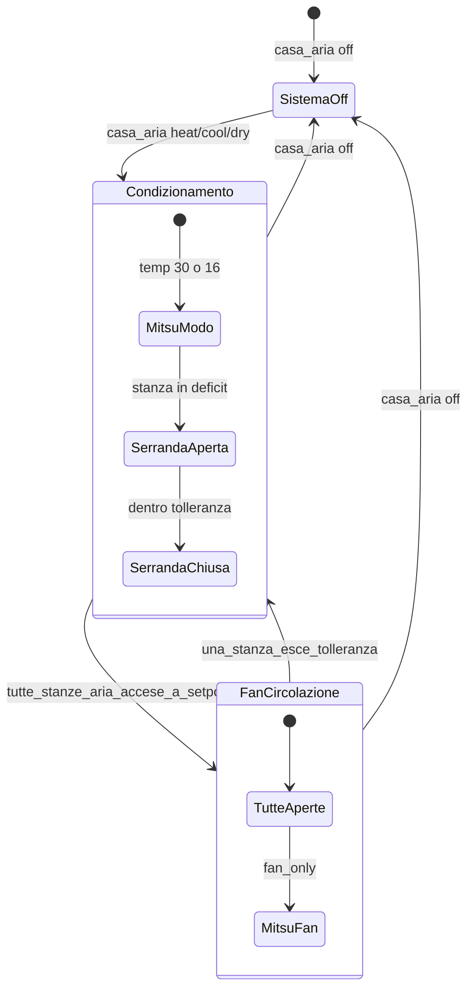

# Piano: orchestratore Mitsubishi + serrande ESP32 (v3)

## REGOLA 1 — invariante di sicurezza (mai violare)

> **Mitsubishi acceso ⇒ almeno 1 serranda aperta.**  
> Senza flusso d'aria il motore si danneggia. Questa regola ha priorità su ogni altra logica.

Implementazione obbligatoria in **tre livelli**:

1. **Ordine comandi** — prima di `climate.set_hvac_mode` su Mitsubishi (qualsiasi modo ≠ off):
   - aprire almeno una serranda (quella della stanza in deficit, o tutte se transizione a fan_only);
   - solo **dopo** conferma `open` / `current_position > 0` → accendere Mitsubishi.
2. **Guardrail in orchestrator** — prima di **chiudere** una serranda mentre Mitsubishi ≠ off:
   - contare le serrande ancora aperte **dopo** la chiusura;
   - se il conteggio sarebbe **0** → **non chiudere**; eseguire invece transizione a `fan_only` + aprire tutte le serrande, oppure spegnere Mitsubishi prima di chiudere l'ultima.
3. **Watchdog** (automazione separata, trigger ogni 30s + su cambio stato):
   ```
   SE climate.koolnova_clima_clim1 != off
   E count(serrande aperte) == 0
   ALLORA:
     1) aprire immediatamente tutte le serrande (o almeno serranda_1)
     2) forzare fan_only se non già
     3) persistent_notification + log critico
   ```
   Il watchdog è **rete di sicurezza**, non il meccanismo primario.

**Perché il design v3 rispetta la REGOLA 1:**
- In condizionamento attivo c'è sempre almeno una stanza in deficit → almeno una serranda aperta.
- Quando tutte a setpoint non si chiude l'ultima serranda e si spegne il motore: si passa a **fan_only con tutte le serrande aperte**.
- Spegnimento sistema (`casa_aria off`): prima Mitsubishi **off**, poi chiudere tutte le serrande.

---

## Principi chiave (v3)

1. **Mitsubishi non conosce le stanze** — temperatura sempre fissa:
   - `heat` → **30°C**
   - `cool` / `dry` → **16°C**
   - `fan_only` → solo ventola (temperatura irrilevante)
2. **Serrande = regolazione zona** — aperte/chiuse solo dall'orchestratore in base a setpoint stanza ± tolleranza.
3. **Tutte a setpoint** → **aprire tutte le serrande**, poi Mitsubishi in **fan_only** (vedi REGOLA 1).
4. **Una stanza esce dalla tolleranza** → Mitsubishi torna al modo globale (heat/cool/dry) per le stanze **aria accese** in deficit.
5. **Display**: modo + ventola globali; per stanza setpoint + **on/off partecipazione aria**. **Nessun** controllo serranda in UI.

---

## Parametri

| Parametro | Valore | Uso |
|---|---|---|
| `SETPOINT_TOLERANCE` | **1.0°C** | Banda intorno al setpoint stanza per aprire/chiudere serranda |
| `FLOOR_OFFSET` | **1.0°C** | Pavimento mira a `setpoint − 1.0` in heat |
| `MITSU_HEAT_TEMP` | **30°C** | Setpoint Mitsubishi in heat |
| `MITSU_COOL_TEMP` | **16°C** | Setpoint Mitsubishi in cool e dry |

`BOOST_THRESHOLD` **non serve più** lato aria: le serrande gestiscono il boost zonale.

---

## Architettura entità



| Entità | Ruolo |
|---|---|
| `climate.casa_aria` | **Globale** — modo (`off/heat/cool/dry/fan_only`) + ventola; uguale su tutti i display |
| `climate.casa_<room>` | **Per stanza** — setpoint + on/off partecipazione aria + temp/umidità + `hvac_action` |
| `climate.koolnova_clima_clim1` | Mitsubishi fisico — comandato solo dall'orchestratore |
| `cover.koolnova_serrande_serranda_1..5` | Serrande — solo orchestratore, mai UI |

---

## Partecipazione aria per stanza

Ogni stanza con serranda ha un **on/off aria** sul proxy stanza (es. `hvac_mode: off` = stanza esclusa dal loop; `heat`/`cool`/… = partecipa — il modo effettivo viene da `casa_aria`).

| Stanza aria accesa | Stanza aria spenta |
|---|---|
| Entra nel calcolo "tutte a setpoint" | Ignorata (serranda chiusa) |
| Serranda auto open/close su temp vs setpoint | Serranda sempre chiusa |
| Conta per riattivazione Mitsubishi | Non conta |

**Stanze solo pavimento** (bagni, ingresso PT): proxy `modes: ["off", "heat"]` — nessun legame con `casa_aria` per l'aria.

**Sala+Cucina**: un setpoint (`sensor.display_sala_temperature`), **due serrande** (4=cucina, 5=sala) — stessa logica per entrambe (aprono/chiudono insieme in base al setpoint sala).

---

## Logica orchestratore `cow_climate_sync_mitsubishi`

Trigger: `casa_aria`, setpoint/on-off qualsiasi `casa_*`, cambio temperatura sensore.

### Se `casa_aria == off`

- Mitsubishi → `off` **per primo**
- Solo dopo conferma Mitsubishi off → tutte le serrande **chiuse** (REGOLA 1: mai chiudere l'ultima serranda con motore ancora acceso)

### Se `casa_aria` in `heat` / `cool` / `dry`

Per ogni stanza **aria accesa** con serranda, calcola `delta`:

| Modo globale | In deficit se… |
|---|---|
| `heat` | `current < setpoint − TOLERANCE` |
| `cool` | `current > setpoint + TOLERANCE` |
| `dry` | stessa banda di cool (MVP) |

**Per stanza in deficit** → aprire serranda(e), **poi** (se Mitsubishi era off) accendere Mitsubishi.

**Per stanza a setpoint** (dentro ±1°C) → chiudere serranda(e) **solo se** dopo la chiusura resta `count(aperte) ≥ 1` oppure Mitsubishi è già in transizione verso off/fan_only (REGOLA 1).

**Mitsubishi**:
- Se **almeno una** stanza aria accesa in deficit:
  1. aprire serrande delle stanze in deficit;
  2. accendere/tenere Mitsubishi in modo globale @ 30 o 16 + fan da `casa_aria`.
- Se **tutte** le stanze aria accese sono a setpoint:
  1. **aprire tutte e 5 le serrande** (obbligatorio prima del cambio modo);
  2. solo dopo → Mitsubishi **`fan_only`**.

**Riattivazione**: stanza esce dalla tolleranza mentre in `fan_only` → aprire serranda(e) di quella stanza **prima** di tornare a heat/cool/dry @ 30/16.

### Se `casa_aria == fan_only`

1. Aprire **tutte** le serrande (stanze aria accese, o tutte e 5)
2. Poi Mitsubishi → `fan_only`

### Watchdog

Vedi sezione **REGOLA 1** — automazione `cow_climate_safety_damper_open` separata, non opzionale.

---

## Fase pavimento (invariata)

| `casa_aria` | Stanza | Pavimento |
|---|---|---|
| `off` | qualsiasi | `off` |
| `heat` | partecipa (aria accesa o solo pavimento) | `heat` @ `setpoint − FLOOR_OFFSET` |
| `cool` / `dry` / `fan_only` | qualsiasi | `off` |

I bagni seguono solo il proprio proxy `off/heat` indipendentemente da `casa_aria`.

---

## Entità globale `climate.casa_aria`

- Proxy MQTT (o binding diretto) con `modes: ["off", "heat", "cool", "dry", "fan_only"]` + fan modes
- L'utente comanda **solo** modo e ventola
- L'orchestratore scrive su Mitsubishi; la `temperature` mostrata su `casa_aria` può essere read-only (30/16/—) o omessa in UI

Config condivisa su tutti i display:

```yaml
system_climate: climate.casa_aria
```

---

## Modifiche UI

### Nessun controllo serranda

Rimosso `damper` / `damper_labels` dalla config card. Le serrande non compaiono in UI.

### Layout display (stanze con aria)

**Sezione sistema** (globale, identica ovunque):

- Chip: Cool → Heat → **Dry** → Fan → Off
- Chip ventola
- Opzionale: indicatore "sistema acceso" derivato da `casa_aria != off`

**Sezione stanza**:

- Toggle **aria on/off** (partecipazione al loop serrande)
- Setpoint (grande, tap-to-type)
- Stato visivo `hvac_action`: heating / cooling / drying / idle / off

**Bagni / ingresso PT**: solo setpoint + off/heat pavimento, senza sezione sistema.

| File | Modifica |
|---|---|
| [`src/config-xl.ts`](src/config-xl.ts) | `system_climate?: string` — NO `damper` |
| [`src/small/config.ts`](src/small/config.ts) | `system_climate?: string` |
| [`src/small/panels/thermostat-panel.ts`](src/small/panels/thermostat-panel.ts) | Sistema globale + stanza (on/off + setpoint) |
| [`src/devices-xl/drawer-tabs/climate-tab.ts`](src/devices-xl/drawer-tabs/climate-tab.ts) | Idem |
| [`src/cow-mobile-dashboard-card.ts`](src/cow-mobile-dashboard-card.ts) | `system_climate`; rimuovere `clima_casa_auto` |
| [`src/devices-xl/clima-casa-bar.ts`](src/devices-xl/clima-casa-bar.ts) | Legare a `casa_aria` |
| [`src/small/state/thermostat.ts`](src/small/state/thermostat.ts) | `dry`, `drying` |

---

## `cow_climate_publish_action` (per stanza)

| Situazione | `hvac_action` |
|---|---|
| `casa_aria == off` o stanza aria off | `off` |
| Pavimento relay ON (heat globale) | `heating` |
| Stanza in deficit + serranda aperta + Mitsubishi in modo attivo | `heating` / `cooling` / `drying` |
| Stanza a setpoint + sistema in `fan_only` + serranda aperta | `idle` |
| Stanza aria off ma pavimento heat (bagni) | `heating` |

---

## Mapping stanze (orchestratore)

| Proxy | Serrande | Pavimento |
|---|---|---|
| `casa_camera_padronale` | `serranda_1` | `display_camera_padronale_pavimento_*` |
| `casa_studio_chiara` | `serranda_2` | `pavimento_camera_2` |
| `casa_camera` | `serranda_3` | `display_camera_1_pavimento_*` |
| `casa_sala_cucina` | `serranda_4`, `serranda_5` | `display_sala_pavimento_*` |
| `casa_ingresso_pt` | — | `pavimento_ingresso_pt` |
| `casa_bagno_*` | — | rispettivi `pavimento_*` |

---

## Pulizia

- Rimuovere: `clima_casa_auto`, lock conflitti, controlli serranda UI, aggregazione setpoint Mitsubishi
- Disabilitare: automazioni/switch koolnova legacy
- Aggiornare: [`docs/06-house-hvac-architecture.md`](docs/06-house-hvac-architecture.md)

---

## Piano di test

1. `casa_aria` heat, camera aria on, setpoint 22°C, current 20°C → serranda 1 aperta, Mitsubishi heat **30°C**
2. Camera raggiunge 21–23°C (±1°C) → serranda 1 **chiusa**
3. Tutte le stanze aria accese a setpoint → **tutte e 5 serrande aperte**, Mitsubishi **fan_only**
4. Una stanza scende sotto setpoint−1°C → Mitsubishi torna **heat 30°C**, si apre solo la sua serranda
5. Stanza con aria **off** → serranda chiusa, non conta nel "tutte a setpoint"
6. `casa_aria` off → Mitsubishi off, tutte serrande chiuse
7. Due display: cambio modo su uno → identico sull'altro
8. Pavimento in heat: ancora `setpoint − 1°C` indipendente dalle serrande
9. **REGOLA 1**: simulare chiusura ultima serranda con Mitsubishi on → orchestrator blocca + watchdog recovery
10. Spegnimento: Mitsubishi off **prima** di chiudere serrande
