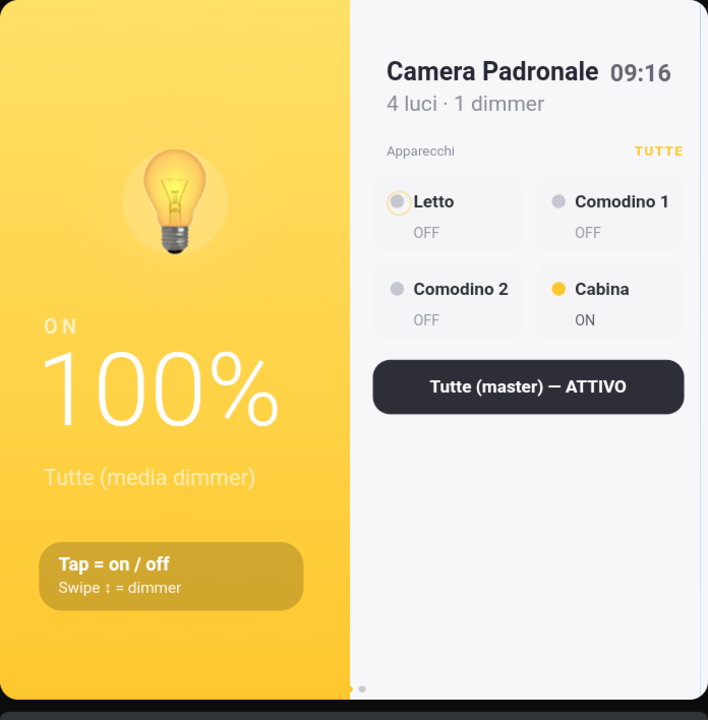
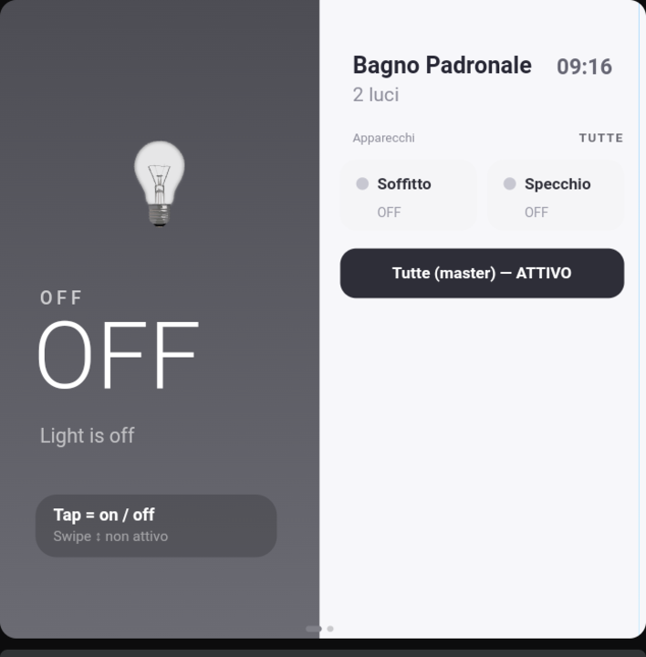
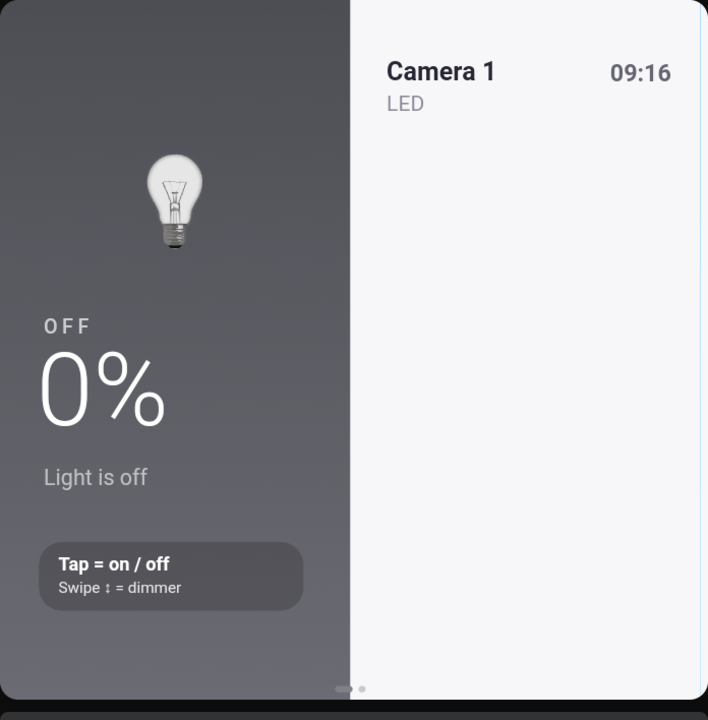
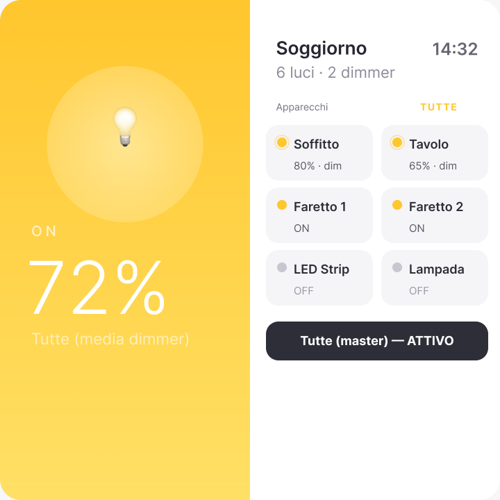
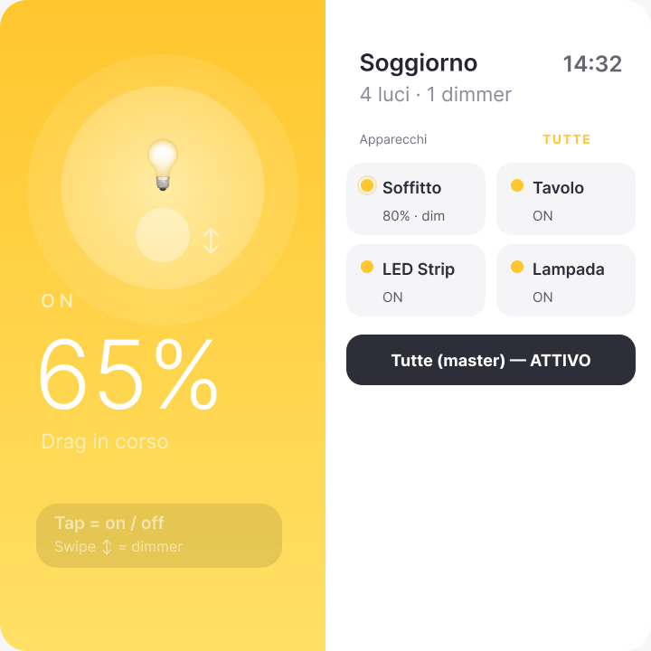
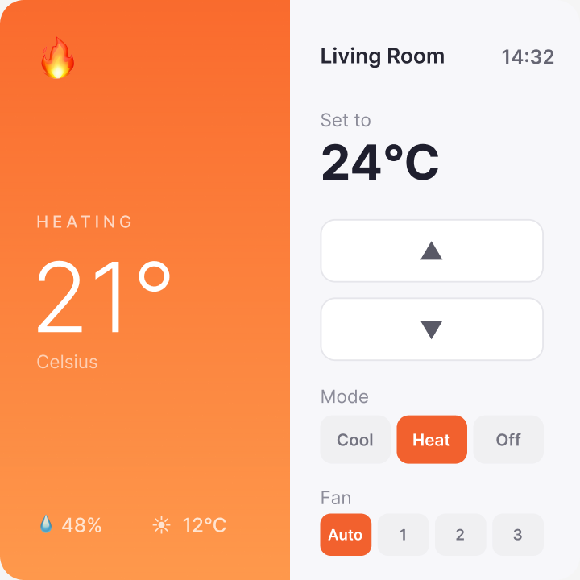
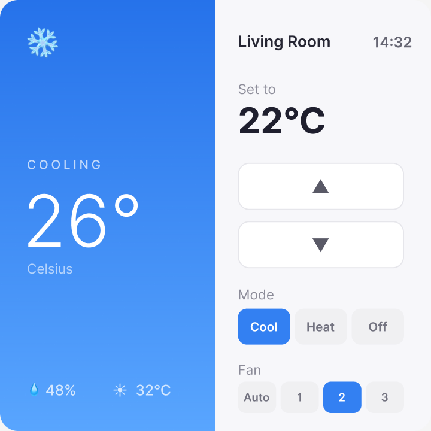
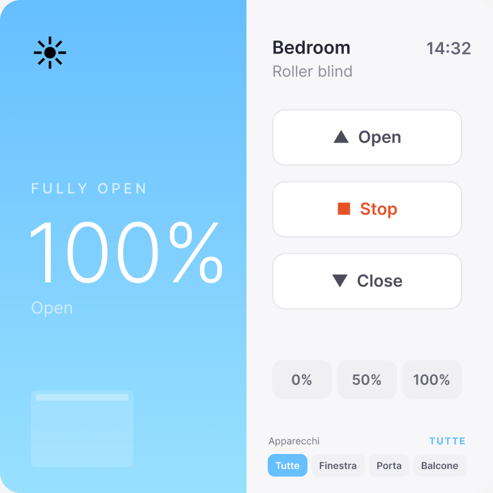
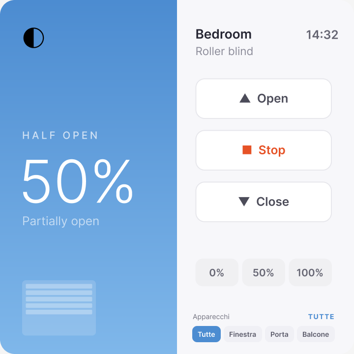

# cow-thermostat-card

> **One pixel-perfect card per room** for Home Assistant — thermostat, lights and blinds in a single Lovelace tile, sized for small square touch displays.

[](https://github.com/i87ce/cow-thermostat-card/releases/latest)
[](./LICENSE)
[](https://hacs.xyz)
[](https://www.shelly.com/products/shelly-wall-display)

<p align="center">
  
  <br>
  <sub><em>Screenshot from a real Shelly Wall Display SAWD1 running v1.2.x</em></sub>
</p>

`cow-thermostat-card` replaces an entire Lovelace dashboard with **one card per room**: a horizontal swipe between three pixel-perfect views (thermostat · lights · blinds), each tracking the live state of your Home Assistant entities. Built specifically for the **Shelly Wall Display SAWD1** (4" 720×720) but scales to any square viewport.

## Why

Generic Lovelace tiles look out of place on a wall-mounted touch panel. This card is sized natively for 720×720, optimized for the MTK6580 SoC's WebView (no `filter: blur`, no canvas, no animation libraries) and works fully offline (Inter font embedded, no CDN calls). One YAML block per room, replicate across every wall display.

---

## Highlights

| | |
|---|---|
| 🎨 **Pixel-perfect** | Every offset, color and font weight derived 1:1 from the [Figma source](https://www.figma.com/design/o61NCf1Pdc2ErT26eH2PHX) |
| 🤏 **Gesture-driven lights** *(v1.2.0)* | Tap the yellow panel to toggle, swipe ↕ to dim. Brightness routes only to dimmable bulbs — no more "this on/off light goes to 100% when I drag the slider" |
| 🎯 **Multi-entity** | Each panel handles a group of lights or covers, with a tile-grid scope picker and a master "Tutte" button |
| 🌐 **Offline** | The 5 Inter font weights ship inlined in the bundle. No internet, no CDN, works on a LAN-only kiosk |
| 🪶 **Lightweight** | ~1 MB single-file release (fonts included), no `filter: blur`, no canvas, no heavy JS — runs on the cheapest touch SoCs |
| 🛠️ **Real HA services** | Calls `climate.set_temperature` / `set_hvac_mode` / `set_fan_mode`, `cover.open/close/stop/set_position`, `light.turn_on/off` directly — no helpers, no scripts |
| 📱 **Scales** | One bundle covers Shelly Wall Display SAWD1 (480×480), Shelly X2i (720×720) and any 1:1 viewport via CSS `transform: scale` |

---

## Screenshots

### Lights — gesture-driven left panel + tile grid scope picker

<table>
  <tr>
    <td></td>
    <td></td>
  </tr>
  <tr>
    <td align="center"><b>Master scope · mixed group</b><br><sub>Real Wall Display screenshot · ring around the dot marks the dimmer</sub></td>
    <td align="center"><b>Master scope · all off (non-dimmer group)</b><br><sub>Big <code>OFF</code> instead of <code>0%</code>, swipe gesture muted</sub></td>
  </tr>
  <tr>
    <td></td>
    <td></td>
  </tr>
  <tr>
    <td align="center"><b>Single light room</b><br><sub>No tile grid, no master button — the bulb visual does everything</sub></td>
    <td align="center"><b>Six lights, 2×3 grid</b><br><sub>Scales without wrapping or scrolling</sub></td>
  </tr>
  <tr>
    <td colspan="2"></td>
  </tr>
  <tr>
    <td colspan="2" align="center"><b>Mid-drag</b> · live halo around the bulb + fingertip indicator + <code>↕</code> arrow following the finger</td>
  </tr>
</table>

**Interaction model**

- **Tap** the yellow panel → toggle on/off on the current scope
- **Swipe ↕** the yellow panel → brightness (only if the scope can be dimmed)
- **Tap a tile** → set that light as the current scope
- **Tap `Tutte (master)`** → control the whole group

A ring around the tile dot is the canonical sign for "this light is dimmable" — no ring means swipe will be inert when that tile is the scope.

### Thermostat

<table>
  <tr>
    <td></td>
    <td></td>
  </tr>
  <tr>
    <td align="center"><b>Heating</b><br><sub>21° · setpoint 24°C · auto fan</sub></td>
    <td align="center"><b>Cooling</b><br><sub>26° · setpoint 22°C · fan 2</sub></td>
  </tr>
</table>

`▲` / `▼` adjust the setpoint, the `Cool` / `Heat` / `Off` row swaps HVAC mode, `Auto` / `1` / `2` / `3` picks the fan mode — every action is a direct `climate.*` service call.

### Blinds

<table>
  <tr>
    <td></td>
    <td></td>
  </tr>
  <tr>
    <td align="center"><b>Fully Open</b><br><sub>Bedroom roller blind at 100%</sub></td>
    <td align="center"><b>Half Open</b><br><sub>Partial position with slat preview</sub></td>
  </tr>
</table>

`▲ Open` / `■ Stop` / `▼ Close` plus `0%` / `50%` / `100%` quick presets for any `cover.*` entity.

---

## Install

### Via HACS (recommended)

1. HACS → ⋮ → **Custom repositories**
2. Repository: `https://github.com/i87ce/cow-thermostat-card`
3. Category: **Lovelace**
4. **Install**, refresh
5. If you're in YAML mode, add to `configuration.yaml`:

   ```yaml
   frontend:
     extra_module_url:
       - /hacsfiles/cow-thermostat-card/cow-thermostat-card.js
   ```

### Manual

```bash
git clone https://github.com/i87ce/cow-thermostat-card
cd cow-thermostat-card
npm install
npm run build         # outputs dist/cow-thermostat-card.js (~1 MB, fonts inlined)
```

Copy `dist/cow-thermostat-card.js` to `<ha-config>/www/cow-thermostat-card/`, then add it as a resource: **Settings → Dashboards → Resources → Add → `/local/cow-thermostat-card/cow-thermostat-card.js` (JavaScript Module)**.

---

## Configure

Per-room YAML:

```yaml
type: custom:cow-thermostat-card
room: "Soggiorno"
climate: climate.living_thermostat
lights:
  - { entity: light.living_ceiling, label: "Soffitto" }
  - { entity: light.living_table,   label: "Tavolo" }
  - { entity: light.living_led,     label: "LED Strip" }
  - { entity: light.living_lamp,    label: "Lampada" }
covers:
  - { entity: cover.living_blind_left,  label: "Sinistra" }
  - { entity: cover.living_blind_right, label: "Destra" }
outdoor_temp:   sensor.weather_temperature
local_temp:     sensor.shelly_walldisplay_living_temperature
local_humidity: sensor.shelly_walldisplay_living_humidity
initial_view: thermostat   # thermostat | lights | blinds
```

**Rules**

- At least one of `climate`, `lights`, `covers` must be set
- The swiper renders only the panels you configured — drop `climate` and you get a 2-panel card, drop two of them and the card becomes a single-panel view without swipe
- `lights` and `covers` accept any number of entities — the panels switch from a single big visual to a tile-grid scope picker as soon as you configure 2 or more
- `initial_view` defaults to the first available panel (`thermostat` → `lights` → `blinds`)

**Legacy v1 schema** (still supported for back-compat):

```yaml
light:        [light.living_ceiling, light.living_table]
light_labels: ["Soffitto", "Tavolo"]
cover:        [cover.living_blind]
cover_labels: ["Tapparella"]
```

Full per-room dashboard examples are in [`examples/dashboards/`](./examples/dashboards/).

---

## Setup guide

Step-by-step docs:

1. [Home Assistant MCP Server + Cursor](./docs/01-ha-mcp-setup.md)
2. [Lovelace dashboard + kiosk mode](./docs/02-lovelace-dashboard.md)
3. [Shelly Wall Display configuration](./docs/03-shelly-wall-display.md)
4. [Visual verification of every variant](./docs/04-visual-verification.md)
5. [Push configuration from HA to the Wall Display](./docs/05-push-configuration-from-ha.md)

---

## Develop

```bash
npm install
npm run lint    # tsc --noEmit
npm run build   # rollup → dist/cow-thermostat-card.js
npm run watch   # rollup --watch
```

Open `examples/preview.html` in a browser to cycle through every variant without a Home Assistant instance attached.

---

## Hardware

This card was designed against the **Shelly Wall Display SAWD1** — a 4" 720×720 touch panel running a stripped-down Chromium on an MTK6580 SoC. The performance budget reflects that target:

- No `filter: blur` / `backdrop-filter` (the SoC drops to 5 fps with either enabled)
- No canvas, no WebGL, no animation libraries
- Touch gestures use `pointer-events` directly, no Hammer.js / no `passive: false` listeners
- Inter font ships inlined as base64 `woff2` so the kiosk works on a LAN with no internet at all
- Single-file bundle (`cow-thermostat-card.js`, ~1 MB) loaded once at boot, cached forever by the WebView

If you have a different square-ish touch panel running a recent-ish Chromium and `aspect-ratio: 1/1` works on it, this card will work too.

---

## Bonus: `cow-room-dashboard-card`

The same bundle ships a second custom element for the **Shelly Wall Display XL** (10.1" landscape, 1280×800): a multi-room dashboard with a live-sky hero (live sun/moon/weather), per-room chip navigator with active-device badges, music player wired to Music Assistant, and pollen tracking. Not the focus of this README — see [`examples/dashboards/`](./examples/dashboards/) for a complete configuration.

---

## License

MIT — see [LICENSE](./LICENSE).
